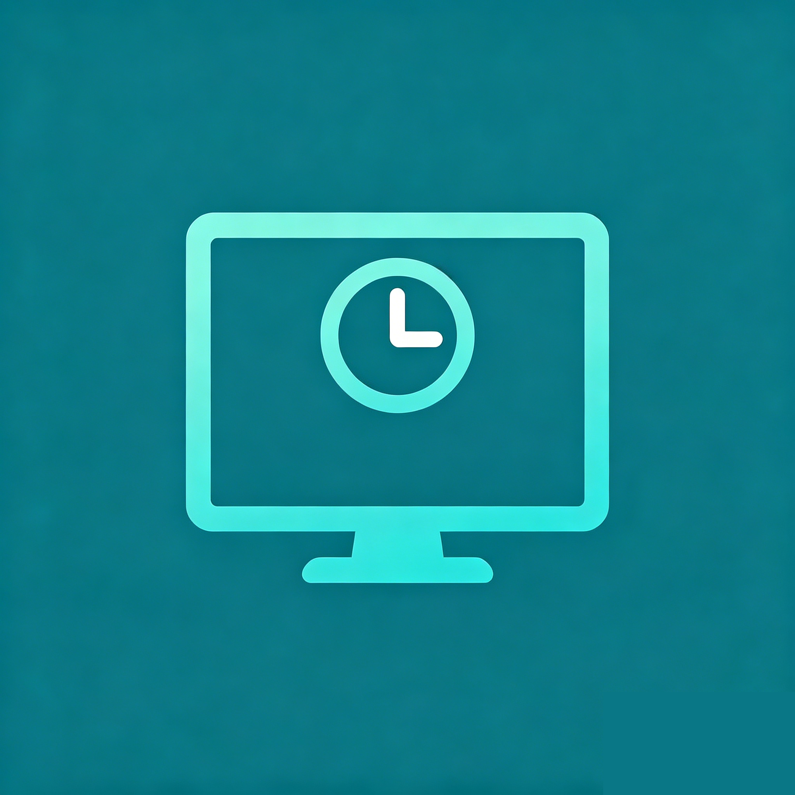

<div align="center">
  <h1>
    
    <br/>
    Screen Time Monitor
  </h1>
  <p>
    <strong>Track how you spend time on your desktop. Build healthier digital habits.</strong><br/>
    <small>记录你的桌面使用时间，养成更健康的数字习惯。</small>
  </p>
  <p>
    
    
    
    
    
    
  </p>
</div>

---

## 📸 Screenshots · 截图

*Coming soon · 即将上线*

---

## ✨ Features · 功能特性

### 📊 Core Tracking · 核心追踪

| 🇬🇧 English | 🇨🇳 中文 |
|---|---|
| Automatically records every app & window via `active-win` | 通过 `active-win` 自动记录每个应用和窗口 |
| Idle detection pauses tracking when AFK | 空闲检测 — 离开键盘时自动暂停追踪 |
| Privacy mode — optionally record only app names | 隐私模式 — 可选择仅记录应用名，不记录窗口标题 |
| All data stored locally in SQLite — nothing leaves your machine | 所有数据存储在本地 SQLite 中，绝不上传 |

### 📈 Reports & Analytics · 报表与分析

| 🇬🇧 English | 🇨🇳 中文 |
|---|---|
| **Today** — real-time dashboard: app rankings, hourly heatmap, pie chart | **今日** — 实时仪表盘：应用排名、小时热力图、饼图 |
| **Weekly** — week-over-week comparison with daily breakdown | **周报** — 周环比对比，每日细分 |
| **Monthly** — monthly totals with weekly trend | **月报** — 月总计，周趋势可视化 |
| **Custom Range** — pick any date range, see trends & rankings | **自定义** — 任意日期范围，趋势和排名一目了然 |
| CSV & PDF export for any report | 支持 CSV 和 PDF 导出 |

### 🎯 Focus Mode · 专注模式

| 🇬🇧 English | 🇨🇳 中文 |
|---|---|
| Whitelist productive apps; everything else = distracted | 白名单设定高效应用；其余计入分心时间 |
| **Productivity Score** — daily focus/distraction ratio (0–100%) | **生产力评分** — 每日专注 vs 分心占比（0–100%） |
| Focus breakdown on the Today dashboard | 今日页面的专注/分心分析面板 |
| **Auto Schedule** — auto-enable Focus Mode on workdays (e.g. Mon–Fri 9:00–18:00) | **自动排程** — 工作日自动开启专注模式（如周一至周五 9:00–18:00） |

### 🔔 Notifications · 通知提醒

| 🇬🇧 English | 🇨🇳 中文 |
|---|---|
| **Pomodoro Timer** — configurable interval (15–60 min) with break reminders | **番茄钟** — 可配置间隔（15–60 分钟），休息提醒 |
| **Sedentary Reminder** — prompts you to stand up (30–120 min) | **久坐提醒** — 定时提醒起身活动（30–120 分钟） |

### 🎨 User Experience · 用户体验

| 🇬🇧 English | 🇨🇳 中文 |
|---|---|
| **Floating Mini Widget** — always-on-top window: current app + today's time + focus status | **悬浮小窗** — 置顶窗口，显示当前应用、今日时长、专注状态 |
| **Onboarding Wizard** — 3-step guided setup for new users | **引导向导** — 三步式新手引导 |
| Light / Dark / System theme toggle | 明/暗/跟随系统 主题切换 |
| Full Chinese (zh-CN) and English (en) localization | 完整中英文国际化 |
| Keyboard shortcuts: `Ctrl+Shift+P` to pause/resume | 快捷键：`Ctrl+Shift+P` 暂停/恢复追踪 |

### ⚙️ System Integration · 系统集成

| 🇬🇧 English | 🇨🇳 中文 |
|---|---|
| **Auto-launch** on Windows startup (registry-level, survives updates) | **开机自启**（注册表级别，升级后仍然有效） |
| System tray with today's summary & quick actions | 系统托盘带今日摘要和快捷操作 |
| **Auto-update** via GitHub Releases (electron-updater) | **自动更新**（基于 GitHub Releases，electron-updater） |
| Hide to tray on close — runs silently in background | 关闭窗口即隐藏到托盘，后台静默运行 |

---

## 🛠 Tech Stack · 技术栈

| Layer · 层级 | Stack · 技术 |
|---|---|
| Runtime · 运行时 | Electron 33 |
| Frontend · 前端 | React 19 · TypeScript · MUI 6 · Tailwind CSS 4 |
| Charts · 图表 | Recharts |
| State · 状态管理 | Zustand |
| Database · 数据库 | SQLite (better-sqlite3) |
| i18n · 国际化 | i18next + react-i18next |
| Build · 构建 | electron-vite 3 · electron-builder 25 |
| Test · 测试 | Vitest |
| Update · 更新 | electron-updater |

---

## 📦 Installation · 安装

Download the latest installer from **[Releases](https://github.com/3013197919/screen-time-monitor/releases)** and run `Screen Time Monitor Setup x.x.x.exe`.

从 **[Releases](https://github.com/3013197919/screen-time-monitor/releases)** 下载最新安装包，运行 `Screen Time Monitor Setup x.x.x.exe` 即可。

The app supports automatic updates — you'll be notified when a new version is available.\
支持自动更新，新版本发布时会收到通知。

---

## 💻 Development · 开发

### Prerequisites · 环境要求

| Requirement · 要求 | Version · 版本 |
|---|---|
| Node.js | ≥ 22 |
| npm | ≥ 10 |
| OS | Windows (for native modules `active-win`, `better-sqlite3`) |

```bash
# Clone & install · 克隆并安装
git clone https://github.com/3013197919/screen-time-monitor.git
cd screen-time-monitor
npm install

# Start dev server · 启动开发服务
npm run dev

# Run tests · 运行测试 (69 tests)
npm test

# Build production · 构建生产版本
npm run build

# Package NSIS Windows installer · 打包 NSIS Windows 安装包
npm run package:win
```

> **Note · 注意:** `npm run package:win` requires Visual Studio Build Tools (C++) and NSIS installed.\
> `npm run package:win` 需要安装 Visual Studio Build Tools（C++ 工作负载）和 NSIS。

---

## 📁 Project Structure · 项目结构

```
├── electron/              # Main process · 主进程
│   ├── main.ts            # Entry, IPC handlers, lifecycle
│   ├── preload.ts         # contextBridge API
│   ├── tracker.ts         # Window polling engine (442 lines)
│   ├── floating-window.ts # Floating mini widget
│   ├── db/                # SQLite database & queries
│   └── services/          # auto-launch, reminder, focus-automation
├── src/                   # Renderer process (React) · 渲染进程
│   ├── App.tsx            # Root component
│   ├── pages/             # Today, Weekly, Monthly, CustomRange, Settings
│   ├── components/        # Reusable UI components
│   ├── store/             # Zustand stores (tracker, settings, update)
│   ├── hooks/             # useReminder
│   ├── contexts/          # ThemeContext
│   ├── i18n/              # zh-CN & en locale files
│   ├── types/             # TypeScript types
│   └── utils/             # Formatters, constants
├── tests/                 # Vitest test suite · 测试套件 (69 tests)
├── docs/                  # Architecture & PRD documents · 架构与需求文档
├── resources/             # App icons & tray assets · 应用图标资源
├── electron-builder.yml   # NSIS packaging config · NSIS 打包配置
└── electron.vite.config.ts # Build config · 构建配置
```

---

## 📄 License · 许可证

MIT © Screen Time Monitor Team
