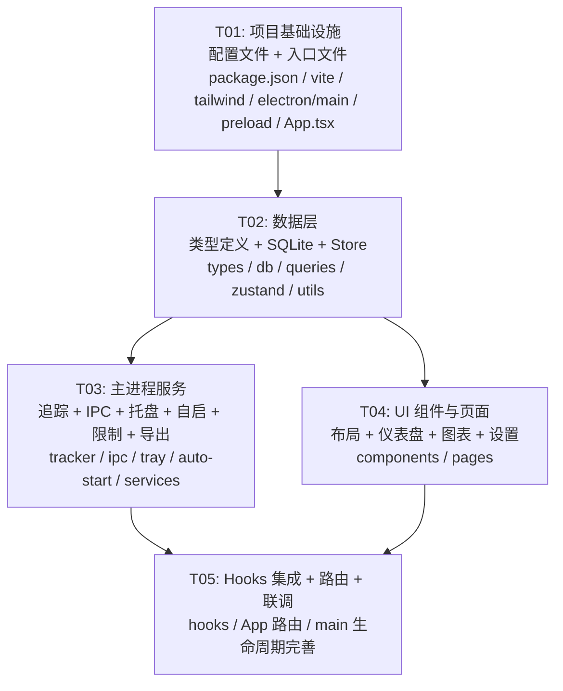

# Screen Time Monitor — 系统架构设计文档

## Part A: 系统设计

---

### 1. 实现方案

#### 1.1 核心技术挑战

| 挑战 | 分析 | 解决方案 |
|------|------|----------|
| **低开销窗口追踪** | 需要持续监听前台窗口切换，但不能影响系统性能 | 使用 `active-win` 轮询（1s 间隔）+ 窗口句柄事件优化，CPU 占用 < 0.5% |
| **跨进程数据通信** | Electron 主进程负责追踪，渲染进程负责展示 | 使用 `contextBridge` + `ipcRenderer/ipcMain` 安全通道，类型安全 TypeScript IPC 协议 |
| **SQLite 并发与性能** | 高频写入（每秒写入使用事件）+ 复杂聚合查询 | `better-sqlite3` 同步 API + 预聚合表（daily_summary），写入用事务批量提交 |
| **系统托盘集成** | Windows 托盘需要原生 API，且需响应菜单事件 | Electron `Tray` + `Menu` API，托盘图标使用 16×16 / 32×32 PNG |
| **开机自启** | 需写入 Windows 注册表 | `electron` 内建 `app.setLoginItemSettings()` 优先，回退写入 `HKCU\Software\Microsoft\Windows\CurrentVersion\Run` |
| **数据加密** | 追踪数据涉及隐私，需本地加密存储 | SQLite 文件级使用 `sqlcipher` 扩展（通过 `@journeyapps/sqlcipher`），密钥由机器唯一标识派生 |

#### 1.2 框架与库选型

| 层级 | 选型 | 版本 | 选型理由 |
|------|------|------|----------|
| **桌面框架** | Electron | ^33.x | 跨平台桌面壳，原生 Windows API 访问能力 |
| **构建工具** | Vite | ^6.x | 极速 HMR，原生 ESM，Electron 插件生态完善 |
| **Electron 构建插件** | `electron-vite` | ^3.x | 一键式 Electron + Vite 集成，支持 main/preload/renderer 三端构建 |
| **UI 框架** | React | ^19.x | 生态成熟，状态管理灵活 |
| **组件库** | MUI (Material UI) | ^6.x | 丰富的 Data Display 组件，Dashboard 类应用首选 |
| **样式** | Tailwind CSS | ^4.x | 原子化样式，快速布局，与 MUI 互补 |
| **图表** | recharts | ^2.x | React 原生，声明式 API，支持折线/柱状/饼图 |
| **窗口追踪** | `active-win` | ^9.x | 跨平台活跃窗口信息获取（进程名 + 窗口标题） |
| **数据库** | `better-sqlite3` | ^11.x | 同步 SQLite API，零依赖原生绑定，性能最优 |
| **数据加密** | `@journeyapps/sqlcipher` | ^6.x | SQLCipher 加密扩展的 Node.js 绑定 |
| **状态管理** | Zustand | ^5.x | 轻量、无 boilerplate、支持订阅切片 |
| **日期处理** | `date-fns` | ^4.x | 函数式、tree-shakable、无时区困扰 |
| **CSV 导出** | `json2csv` (renderer) / 自定义 | — | 简单 CSV 生成，避免重量级依赖 |
| **空闲检测** | Windows `GetLastInputInfo` (通过 `node-ffi` 或原生模块) | — | 轮询键盘/鼠标最后输入时间 |
| **打包** | `electron-builder` | ^25.x | Windows NSIS 安装包，自动更新支持 |
| **图标** | `lucide-react` | ^0.x | 轻量 SVG 图标库，与 MUI 配合 |

#### 1.3 架构模式

采用 **Electron 经典分层架构**（主进程 / 预加载 / 渲染进程），渲染层内部采用 **Container-Presenter 模式**：

```
┌─────────────────────────────────────────────────────┐
│                   Renderer Process                   │
│  ┌──────────┐ ┌──────────┐ ┌──────────┐ ┌────────┐ │
│  │  Pages    │ │Components│ │  Hooks   │ │ Store  │ │
│  │ Today/   │ │Dashboard │ │useIpc    │ │Zustand │ │
│  │ Week/    │ │ Charts/  │ │useTracker│ │        │ │
│  │ Month/   │ │ Settings/│ │useChart  │ │        │ │
│  │ Settings │ │ Layout   │ │          │ │        │ │
│  └────┬─────┘ └────┬─────┘ └────┬─────┘ └───┬────┘ │
│       └─────────────┴────────────┴────────────┘      │
│                        │ IPC (contextBridge)         │
├────────────────────────┼────────────────────────────┤
│              Preload Script (preload.ts)              │
│          暴露类型安全的 electronAPI 到渲染进程          │
├────────────────────────┼────────────────────────────┤
│                   Main Process                        │
│  ┌──────────┐ ┌──────────┐ ┌──────────┐ ┌────────┐ │
│  │ Tracker  │ │   IPC    │ │   Tray   │ │   DB   │ │
│  │ window-  │ │ Handlers │ │  Manager │ │ SQLite │ │
│  │ tracker  │ │          │ │          │ │        │ │
│  │ idle-    │ │          │ │          │ │        │ │
│  │ detector │ │          │ │          │ │        │ │
│  └────┬─────┘ └────┬─────┘ └────┬─────┘ └───┬────┘ │
│       └─────────────┴────────────┴────────────┘      │
│                        │                             │
│               Services (业务逻辑层)                    │
│  ┌───────────────┐ ┌────────────┐ ┌──────────────┐  │
│  │tracker-service│ │limit-service│ │export-service│  │
│  └───────────────┘ └────────────┘ └──────────────┘  │
└─────────────────────────────────────────────────────┘
```

---

### 2. 文件列表

```
screen_time_monitor/
├── package.json                          # 项目依赖与脚本
├── electron-builder.yml                  # electron-builder 打包配置
├── tsconfig.json                         # TypeScript 通用配置
├── tsconfig.node.json                    # Node 端 TS 配置 (main/preload)
├── tsconfig.web.json                     # Web 端 TS 配置 (renderer)
├── vite.config.ts                        # Vite 构建配置 (electron-vite)
├── tailwind.config.ts                    # Tailwind CSS 配置
├── postcss.config.js                     # PostCSS 配置
├── index.html                            # 入口 HTML
│
├── electron/                             # --- 主进程代码 ---
│   ├── main.ts                           # Electron 入口：窗口创建、生命周期
│   ├── preload.ts                        # contextBridge 预加载脚本
│   ├── tracker/
│   │   ├── window-tracker.ts             # 前台窗口切换监听 + 计时
│   │   └── idle-detector.ts             # 键鼠空闲检测 (P2)
│   ├── db/
│   │   ├── database.ts                   # SQLite 连接管理 + 初始化
│   │   ├── migrations.ts                 # 数据库 Schema 迁移
│   │   └── queries.ts                    # 数据查询封装 (CRUD + 聚合)
│   ├── ipc/
│   │   └── handlers.ts                   # 所有 IPC 通道处理器注册
│   ├── tray/
│   │   └── tray-manager.ts               # 系统托盘图标 + 右键菜单
│   ├── auto-start/
│   │   └── registry.ts                   # Windows 注册表开机自启
│   └── services/
│       ├── tracker-service.ts            # 追踪业务逻辑（事件→记录→聚合）
│       ├── limit-service.ts              # 使用限制检查与提醒
│       └── export-service.ts             # CSV/PDF 数据导出
│
├── src/                                  # --- 渲染进程代码 ---
│   ├── main.tsx                          # React 入口
│   ├── App.tsx                           # 根组件：路由 + 布局
│   ├── index.css                         # 全局样式 + Tailwind 指令
│   ├── types/
│   │   ├── models.ts                     # 业务数据模型类型定义
│   │   └── electron.ts                   # IPC 接口类型定义 (electronAPI)
│   ├── hooks/
│   │   ├── useIpc.ts                     # IPC 调用封装 Hook
│   │   ├── useTracker.ts                 # 追踪状态 Hook
│   │   └── useChartData.ts               # 图表数据转换 Hook
│   ├── store/
│   │   ├── trackerStore.ts               # 追踪状态 Zustand Store
│   │   └── settingsStore.ts              # 设置 Zustand Store
│   ├── components/
│   │   ├── layout/
│   │   │   ├── Sidebar.tsx               # 左侧导航栏
│   │   │   └── AppLayout.tsx             # 全局布局壳
│   │   ├── dashboard/
│   │   │   ├── TotalTimeCard.tsx         # 今日总时长卡片
│   │   │   ├── ActiveHoursHeatmap.tsx    # 活跃时段热力图
│   │   │   └── AppRankingList.tsx        # 应用排行列表（进度条+百分比）
│   │   ├── charts/
│   │   │   ├── TrendLineChart.tsx        # 日趋势折线图
│   │   │   ├── WeeklyBarChart.tsx        # 周/月柱状图
│   │   │   └── DistributionPieChart.tsx  # 应用分布饼图
│   │   ├── settings/
│   │   │   ├── LimitList.tsx             # 使用限制配置列表
│   │   │   └── GeneralSettings.tsx       # 通用设置（自启、空闲阈值等）
│   │   └── common/
│   │       └── ProgressBar.tsx           # 可复用进度条组件
│   ├── pages/
│   │   ├── TodayPage.tsx                 # 今日视图页
│   │   ├── WeeklyPage.tsx                # 周报视图页
│   │   ├── MonthlyPage.tsx               # 月报视图页
│   │   └── SettingsPage.tsx              # 设置页
│   └── utils/
│       ├── format.ts                     # 时间/时长格式化工具
│       └── constants.ts                  # 全局常量定义
│
└── resources/                            # --- 静态资源 ---
    ├── icon.png                          # 应用图标 (256×256)
    ├── tray-icon.png                     # 托盘图标 (16×16)
    └── tray-icon@2x.png                  # 托盘图标 (32×32)
```

---

### 3. 数据结构与接口（类图）

详见 `docs/class-diagram.mermaid`，以下为文字说明。

#### 3.1 主进程核心类

**Database（数据库连接管理）**
```
class Database {
  - db: BetterSqlite3.Database
  + constructor(dbPath: string, encryptionKey: string)
  + getDb(): BetterSqlite3.Database
  + close(): void
  + runMigrations(): void
}
```

**Migrations（数据库迁移）**
```
class Migrations {
  + static run(db: BetterSqlite3.Database): void
  - static createAppEventsTable(db): void
  - static createDailySummaryTable(db): void
  - static createUsageLimitsTable(db): void
  - static createSettingsTable(db): void
  - static createAppCategoriesTable(db): void   // P2
}
```

**Queries（数据查询封装）**
```
class Queries {
  - db: BetterSqlite3.Database
  + constructor(db: BetterSqlite3.Database)
  // 事件记录
  + insertEvent(event: AppEventInput): void
  + getEventsInRange(start: string, end: string): AppEvent[]
  // 每日聚合
  + upsertDailySummary(appName: string, date: string, duration: number): void
  + getDailySummary(date: string): DailySummary[]
  + getWeeklySummary(weekStart: string): WeeklySummary[]
  + getMonthlySummary(month: string): MonthlySummary[]
  // 排行榜
  + getAppRanking(date: string, limit: number): AppRankingRow[]
  // 限制
  + getUsageLimits(): UsageLimit[]
  + setUsageLimit(limit: UsageLimitInput): void
  + deleteUsageLimit(id: number): void
  // 设置
  + getSetting(key: string): string | null
  + setSetting(key: string, value: string): void
  // 导出
  + getExportData(startDate: string, endDate: string): ExportRow[]
}
```

**WindowTracker（窗口追踪器）**
```
class WindowTracker {
  - pollingInterval: NodeJS.Timer | null
  - currentApp: string
  - currentWindow: string
  - sessionStart: number
  - isTracking: boolean
  - onAppSwitch: (event: AppSwitchEvent) => void
  + constructor(callback: (event) => void)
  + start(): void
  + stop(): void
  + pause(): void
  + resume(): void
  + getStatus(): TrackerStatus
  - poll(): Promise<void>
}
```

**IdleDetector（空闲检测器，P2）**
```
class IdleDetector {
  - idleThreshold: number      // 默认 5 分钟
  - checkInterval: NodeJS.Timer | null
  - isIdle: boolean
  - onIdleChange: (isIdle: boolean) => void
  + constructor(threshold: number, callback: (isIdle: boolean) => void)
  + start(): void
  + stop(): void
  + setThreshold(minutes: number): void
  - check(): void
}
```

**TrayManager（托盘管理器）**
```
class TrayManager {
  - tray: Tray
  - menu: Menu
  - mainWindow: BrowserWindow
  + constructor(mainWindow: BrowserWindow, trackerStatus: () => TrackerStatus)
  + buildMenu(): Menu
  + updateTodaySummary(summary: string): void
  + destroy(): void
}
```

**TrackerService（追踪业务服务）**
```
class TrackerService {
  - windowTracker: WindowTracker
  - queries: Queries
  - idleDetector: IdleDetector | null
  - db: Database
  + constructor(db: Database)
  + start(): void
  + stop(): void
  + pause(): void
  + resume(): void
  + getStatus(): TrackerStatus
  + getTodaySummary(): Promise<TodaySummaryData>
  - handleAppSwitch(event: AppSwitchEvent): void
  - flushCurrentSession(): void
}
```

**LimitService（限制服务）**
```
class LimitService {
  - queries: Queries
  - onLimitReached: (appName: string, limitMin: number, usedMin: number) => void
  + constructor(queries: Queries, callback)
  + checkLimits(appName: string): LimitCheckResult
  + getAllLimits(): UsageLimit[]
  + setLimit(appName: string, limitMinutes: number): void
  + removeLimit(appName: string): void
}
```

**ExportService（导出服务）**
```
class ExportService {
  - queries: Queries
  + constructor(queries: Queries)
  + exportCsv(startDate: string, endDate: string, savePath: string): Promise<string>
  + exportPdf(startDate: string, endDate: string, savePath: string): Promise<string>  // P2
}
```

#### 3.2 渲染进程核心类型

```typescript
// === 数据模型 ===
interface AppEvent {
  id: number
  app_name: string
  window_title: string
  started_at: string   // ISO 8601
  ended_at: string      // ISO 8601
  duration: number      // 秒
  date: string          // YYYY-MM-DD
}

interface DailySummary {
  id: number
  app_name: string
  date: string          // YYYY-MM-DD
  total_duration: number // 秒
}

interface UsageLimit {
  id: number
  app_name: string
  limit_minutes: number
  enabled: boolean
}

// === 展示模型 ===
interface AppUsageItem {
  app_name: string
  duration: number      // 秒
  percentage: number    // 0-100
  formattedDuration: string  // "2h 35m"
}

interface TodaySummaryData {
  total_seconds: number
  formatted_total: string
  active_apps_count: number
  top_apps: AppUsageItem[]
  hourly_heatmap: number[]  // 24 个值，每小时活跃分钟数
}

interface WeeklyReportData {
  week_label: string
  daily_totals: { date: string; total_seconds: number }[]
  app_distribution: AppUsageItem[]
  trend_data: { date: string; duration: number }[]  // 每日趋势
  previous_week_comparison: { diff_percent: number }
}

interface MonthlyReportData {
  month_label: string
  weekly_totals: { week: string; total_seconds: number }[]
  app_distribution: AppUsageItem[]
  previous_month_comparison: { diff_percent: number }
}

// === IPC 接口 ===
interface ElectronAPI {
  // 追踪控制
  tracker: {
    getStatus: () => Promise<TrackerStatus>
    pause: () => Promise<void>
    resume: () => Promise<void>
    onStatusChange: (callback: (status: TrackerStatus) => void) => void
  }
  // 数据查询
  data: {
    getTodaySummary: () => Promise<TodaySummaryData>
    getWeeklyReport: (weekStart?: string) => Promise<WeeklyReportData>
    getMonthlyReport: (month?: string) => Promise<MonthlyReportData>
    getAppRanking: (date: string, limit: number) => Promise<AppUsageItem[]>
  }
  // 使用限制
  limits: {
    getAll: () => Promise<UsageLimit[]>
    set: (appName: string, limitMinutes: number) => Promise<void>
    delete: (id: number) => Promise<void>
    onLimitReached: (callback: (data: LimitReachedData) => void) => void
  }
  // 导出
  export: {
    csv: (startDate: string, endDate: string) => Promise<string>  // 返回保存路径
  }
  // 设置
  settings: {
    get: (key: string) => Promise<string | null>
    set: (key: string, value: string) => Promise<void>
    getAll: () => Promise<Record<string, string>>
  }
  // 应用
  app: {
    getVersion: () => Promise<string>
    quit: () => void
  }
}

interface TrackerStatus {
  is_tracking: boolean
  is_paused: boolean
  current_app: string | null
  current_session_start: number | null
}

interface LimitReachedData {
  app_name: string
  limit_minutes: number
  used_minutes: number
}
```

#### 3.3 数据库表结构（ER）

```sql
-- 原始窗口事件表
CREATE TABLE app_events (
  id INTEGER PRIMARY KEY AUTOINCREMENT,
  app_name TEXT NOT NULL,           -- 进程名
  window_title TEXT NOT NULL,       -- 窗口标题（可能截断）
  started_at TEXT NOT NULL,         -- ISO 8601
  ended_at TEXT NOT NULL,           -- ISO 8601
  duration INTEGER NOT NULL,        -- 秒
  date TEXT NOT NULL                -- YYYY-MM-DD，查询索引
);
CREATE INDEX idx_events_date ON app_events(date);
CREATE INDEX idx_events_app ON app_events(app_name, date);

-- 每日聚合表（预计算，加速查询）
CREATE TABLE daily_summary (
  id INTEGER PRIMARY KEY AUTOINCREMENT,
  app_name TEXT NOT NULL,
  date TEXT NOT NULL,               -- YYYY-MM-DD
  total_duration INTEGER NOT NULL,  -- 秒
  UNIQUE(app_name, date)
);
CREATE INDEX idx_daily_date ON daily_summary(date);

-- 使用限制表
CREATE TABLE usage_limits (
  id INTEGER PRIMARY KEY AUTOINCREMENT,
  app_name TEXT NOT NULL UNIQUE,
  limit_minutes INTEGER NOT NULL,
  enabled INTEGER NOT NULL DEFAULT 1
);

-- 设置表（KV 存储）
CREATE TABLE settings (
  key TEXT PRIMARY KEY,
  value TEXT NOT NULL
);

-- 应用分类标签表（P2）
CREATE TABLE app_categories (
  id INTEGER PRIMARY KEY AUTOINCREMENT,
  app_name TEXT NOT NULL UNIQUE,
  category TEXT NOT NULL           -- 'work' | 'study' | 'entertainment' | 'other'
);
```

---

### 4. 程序调用流程（时序图）

详见 `docs/sequence-diagram.mermaid`，以下为核心流程文字描述。

#### 4.1 应用启动 → 追踪初始化

1. `main.ts` 创建 `BrowserWindow`（加载 renderer）
2. `main.ts` 初始化 `Database`（加密连接 + 运行迁移）
3. `main.ts` 创建 `Queries` → `TrackerService` → `LimitService` → `ExportService`
4. `main.ts` 创建 `TrayManager`（注册系统托盘）
5. `main.ts` 注册所有 `IpcHandlers`
6. `main.ts` 调用 `trackerService.start()` 开始窗口追踪
7. Renderer 端 `App.tsx` 加载，通过 `electronAPI` 获取初始状态

#### 4.2 窗口切换 → 使用事件记录

1. `WindowTracker.poll()` 每秒调用 `activeWin()` 获取当前活跃窗口
2. 检测到窗口切换 → 计算上一会话时长
3. 触发 `onAppSwitch` 回调 → `TrackerService.handleAppSwitch()`
4. `TrackerService` 调用 `Queries.insertEvent()` 写入原始事件
5. `TrackerService` 调用 `Queries.upsertDailySummary()` 更新每日聚合
6. `LimitService.checkLimits()` 检查是否超限 → 如超限通过 IPC 通知渲染进程弹窗

#### 4.3 用户查看今日概况

1. 用户点击左侧「今日」导航（或默认加载）
2. `TodayPage` 挂载 → `useTracker` Hook 调用 `electronAPI.data.getTodaySummary()`
3. IPC → 主进程 `Queries.getDailySummary(today)` + `Queries.getAppRanking(today, 10)`
4. 主进程返回聚合数据 → Store 更新 → 组件渲染
5. `TotalTimeCard` 展示总时长，`ActiveHoursHeatmap` 展示热力图，`AppRankingList` 展示排行

#### 4.4 超限提醒流程（P1）

1. `WindowTracker` 检测到切换至应用 A
2. `TrackerService.handleAppSwitch()` → `LimitService.checkLimits("A")`
3. `LimitService` 查询 `usage_limits` 表 + `daily_summary` 今日已用量
4. 如已超限 → 主进程通过 IPC `limits:on-limit-reached` 推送消息
5. 渲染进程收到 → Store 更新 → `setTimeout` 触发弹窗（`AlertDialog`）
6. 用户可关闭弹窗继续使用（P1 软提醒）

#### 4.5 CSV 导出流程

1. 用户在设置页选择日期范围，点击「导出 CSV」
2. `SettingsPage` → `electronAPI.export.csv(startDate, endDate)`
3. IPC → `ExportService.exportCsv()` → 调用 `dialog.showSaveDialog()` 选择保存路径
4. `Queries.getExportData()` 查询原始数据 → 格式化为 CSV 字符串
5. `fs.writeFileSync()` 写入文件 → 返回文件路径给渲染进程
6. 渲染进程显示成功提示

---

### 5. 待明确事项（UNCLEAR）

| # | 事项 | 当前决策 | 需要确认 |
|---|------|----------|----------|
| 1 | **SQLite 加密方案** | 使用 `@journeyapps/sqlcipher` 加密扩展，密钥由机器 SID + 固定盐值派生 | 是否接受引入原生编译依赖？备选方案为 `better-sqlite3` + 应用层 AES 加密 |
| 2 | **空闲检测实现** | Windows 平台通过 `kernel32.dll` 的 `GetLastInputInfo` 轮询检测 | 是否使用 `iohook`（原生键盘钩子）？后者精度更高但有安全软件误报风险 |
| 3 | **热力图粒度** | 按小时统计（24 格），颜色深浅表示该小时活跃分钟数 | 是否需要更细粒度（48 格，半小时）？是否需要区分不同应用的热力图？ |
| 4 | **窗口标题隐私** | 存储完整窗口标题（可能含敏感信息如文件名、聊天对象名） | 是否需要仅保留进程名、对窗口标题做哈希或截断处理？是否需要隐私开关？ |
| 5 | **周报/月报的对比基准** | 与前一周/前一月同时段对比 | 确认对比维度：总时长百分比变化？应用分布变化？是否需要"环比"标签？ |
| 6 | **多实例保护** | 当前设计为单实例（`app.requestSingleInstanceLock()`） | 确认不需要多用户支持？ |
| 7 | **数据保留策略** | 当前设计无自动清理，无限保留原始事件 | 是否需要自动清理 N 天前的原始事件（仅保留聚合数据）？ |
| 8 | **暂停追踪的持久化** | 当前设计：暂停状态仅内存保存，应用重启后自动恢复追踪 | 是否需要持久化暂停状态？ |

---

## Part B: 任务分解

---

### 6. 依赖包列表

```
# 生产依赖
electron@^33.0.0
better-sqlite3@^11.0.0
@journeyapps/sqlcipher@^6.0.0

# 渲染进程依赖
react@^19.0.0
react-dom@^19.0.0
@mui/material@^6.0.0
@mui/icons-material@^6.0.0
@emotion/react@^11.0.0
@emotion/styled@^11.0.0
recharts@^2.15.0
zustand@^5.0.0
date-fns@^4.0.0
lucide-react@^0.500.0

# 主进程依赖
active-win@^9.0.0
electron-store@^10.0.0   （可选：备选设置存储方案）

# 开发依赖
electron-builder@^25.0.0
electron-vite@^3.0.0
vite@^6.0.0
typescript@^5.7.0
tailwindcss@^4.0.0
@tailwindcss/vite@^4.0.0
postcss@^8.0.0
autoprefixer@^10.0.0
@types/react@^19.0.0
@types/react-dom@^19.0.0
@types/better-sqlite3@^7.0.0
```

---

### 7. 任务列表（按依赖顺序）

---

#### T01: 项目基础设施搭建

| 属性 | 内容 |
|------|------|
| **Task ID** | T01 |
| **任务名称** | 项目基础设施搭建（配置文件 + 入口文件 + 主进程骨架） |
| **优先级** | P0 |
| **依赖** | 无 |

**包含文件**（13 个）：

| 文件 | 说明 |
|------|------|
| `package.json` | 项目依赖声明、脚本（dev/build/package） |
| `electron-builder.yml` | electron-builder 打包配置（NSIS、appId、图标路径） |
| `tsconfig.json` | TypeScript 通用编译配置 |
| `tsconfig.node.json` | Node 端 TS 配置（main + preload，target: ESNext, module: CommonJS） |
| `tsconfig.web.json` | Web 端 TS 配置（renderer，jsx: react-jsx） |
| `vite.config.ts` | electron-vite 配置（main/preload/renderer 三端入口） |
| `tailwind.config.ts` | Tailwind CSS 配置（content 路径、自定义主题色） |
| `postcss.config.js` | PostCSS 配置（tailwindcss + autoprefixer 插件） |
| `index.html` | 入口 HTML（`<div id="root">` + `<script src="./src/main.tsx">`） |
| `electron/main.ts` | Electron 入口：窗口创建、生命周期、数据库初始化（骨架）、托盘初始化（骨架）、IPC 注册（骨架） |
| `electron/preload.ts` | contextBridge 暴露类型安全的 `electronAPI`（所有 IPC 通道声明） |
| `src/main.tsx` | React 入口（createRoot + render App） |
| `src/App.tsx` | 根组件骨架（MUI ThemeProvider + CssBaseline + 占位布局） |
| `src/index.css` | Tailwind 指令（@tailwind base/components/utilities）+ 全局样式 |
| `resources/icon.png` | 应用图标占位（256×256） |
| `resources/tray-icon.png` | 托盘图标占位（16×16） |
| `resources/tray-icon@2x.png` | 托盘图标占位（32×32） |

**验收标准**：
- `npm run dev` 可启动 Electron 窗口，显示空白页面
- Tailwind CSS + MUI 正常加载，无样式冲突
- TypeScript 编译零错误
- Preload 脚本正常工作，`window.electronAPI` 可访问（console 验证）

---

#### T02: 数据层（类型定义 + SQLite 数据库 + 状态管理）

| 属性 | 内容 |
|------|------|
| **Task ID** | T02 |
| **任务名称** | 数据层：类型定义 + SQLite 数据库（建表/迁移/查询）+ Zustand 状态管理 |
| **优先级** | P0 |
| **依赖** | T01（项目基础设施） |

**包含文件**（9 个）：

| 文件 | 说明 |
|------|------|
| `src/types/models.ts` | 所有业务数据模型 TypeScript 接口/类型（AppEvent, DailySummary, UsageLimit, AppUsageItem, TodaySummaryData, WeeklyReportData, MonthlyReportData, TrackerStatus 等） |
| `src/types/electron.ts` | ElectronAPI 接口定义、IPC 通道类型常量 |
| `electron/db/database.ts` | SQLite 连接管理类（Database）：初始化加密连接、运行迁移、优雅关闭 |
| `electron/db/migrations.ts` | 数据库迁移类（Migrations）：创建 app_events / daily_summary / usage_limits / settings / app_categories 五张表，含索引 |
| `electron/db/queries.ts` | 数据查询封装类（Queries）：insertEvent / upsertDailySummary / getDailySummary / getWeeklySummary / getMonthlySummary / getAppRanking / CRUD usage_limits / getSetting / setSetting / getExportData |
| `src/store/trackerStore.ts` | Zustand Store：追踪状态 + 今日数据 + 周/月报告数据 + actions |
| `src/store/settingsStore.ts` | Zustand Store：设置状态（自启、空闲阈值等）+ 使用限制列表 + actions |
| `src/utils/format.ts` | 格式化工具函数：formatDuration(seconds) → "2h 35m"、formatDate()、formatPercentage() 等 |
| `src/utils/constants.ts` | 全局常量：DEFAULT_IDLE_TIMEOUT、APP_NAME、POLL_INTERVAL、IPC_CHANNELS 等 |

**验收标准**：
- Database 类可成功连接加密 SQLite 并执行迁移
- Queries 类所有方法单元测试通过（手动或脚本验证）
- 类型定义在 main/preload/renderer 三端编译通过
- Zustand Store 可正常读写状态

---

#### T03: Electron 主进程服务（追踪 + IPC + 托盘 + 自启 + 限制 + 导出）

| 属性 | 内容 |
|------|------|
| **Task ID** | T03 |
| **任务名称** | Electron 主进程服务层：窗口追踪、IPC 通信、系统托盘、开机自启、使用限制、数据导出 |
| **优先级** | P0（核心服务）/ P1（限制/导出） |
| **依赖** | T02（数据层） |

**包含文件**（8 个）：

| 文件 | 说明 |
|------|------|
| `electron/tracker/window-tracker.ts` | WindowTracker 类：active-win 轮询，窗口切换检测，会话计时，pause/resume/stop |
| `electron/tracker/idle-detector.ts` | IdleDetector 类（P2 框架预留）：GetLastInputInfo 轮询，空闲状态切换回调 |
| `electron/services/tracker-service.ts` | TrackerService 类：整合 WindowTracker + Queries，处理 appSwitch → insertEvent + upsertSummary |
| `electron/services/limit-service.ts` | LimitService 类：超限检查逻辑，触发 IPC 通知渲染进程弹窗 |
| `electron/services/export-service.ts` | ExportService 类：CSV 导出（dialog.showSaveDialog + fs.writeFileSync） |
| `electron/ipc/handlers.ts` | IpcHandlers 注册函数：注册所有 IPC 通道（tracker.* / data.* / limits.* / export.* / settings.* / app.*），调用对应 Service |
| `electron/tray/tray-manager.ts` | TrayManager 类：系统托盘图标、右键菜单（今日概况摘要/暂停追踪/打开主面板/退出）、动态更新菜单项 |
| `electron/auto-start/registry.ts` | 开机自启管理：app.setLoginItemSettings() + 注册表写入，启用/禁用/查询状态 |

**验收标准**：
- WindowTracker 可在后台追踪活跃窗口切换，CPU 占用 < 1%
- 托盘图标正常显示，右键菜单功能正常
- IPC 通道全部连通，渲染进程可获取追踪数据和状态
- 使用限制超限时渲染进程可收到通知
- CSV 导出功能正常（选择路径 + 写入文件）

---

#### T04: 渲染进程 UI 组件与页面

| 属性 | 内容 |
|------|------|
| **Task ID** | T04 |
| **任务名称** | 渲染进程 UI 层：布局组件 + 仪表盘组件 + 图表组件 + 设置组件 + 页面组装 |
| **优先级** | P0（今日页）/ P1（周报/月报/图表/设置） |
| **依赖** | T02（类型定义 + Store）、T03（IPC 通道可用） |

**包含文件**（15 个）：

| 文件 | 说明 |
|------|------|
| `src/components/layout/Sidebar.tsx` | 左侧导航栏：TodayIcon/WeekIcon/MonthIcon/SettingsIcon，active 状态高亮，路由切换 |
| `src/components/layout/AppLayout.tsx` | 全局布局壳：Sidebar + 内容区（Outlet），响应式适配 |
| `src/components/dashboard/TotalTimeCard.tsx` | 大数字卡片：今日总时长（MUI Card + Typography），带动画数字 |
| `src/components/dashboard/ActiveHoursHeatmap.tsx` | 活跃时段热力图：24 格网格，颜色深浅表示活跃度（MUI Grid + 自定义色阶） |
| `src/components/dashboard/AppRankingList.tsx` | 应用排行 Top 10：图标 + 应用名 + 时长 + 进度条 + 百分比（MUI LinearProgress） |
| `src/components/charts/TrendLineChart.tsx` | 日趋势折线图：recharts LineChart，X 轴日期 Y 轴时长，tooltip 悬浮详情 |
| `src/components/charts/WeeklyBarChart.tsx` | 周/月柱状图：recharts BarChart，X 轴周期 Y 轴总时长，支持与前周期对比 |
| `src/components/charts/DistributionPieChart.tsx` | 应用分布饼图：recharts PieChart，自定义 label（应用名+百分比），图例 |
| `src/components/settings/LimitList.tsx` | 使用限制列表：MUI List，每项显示应用名+上限分钟数，支持添加/编辑/删除（Dialog） |
| `src/components/settings/GeneralSettings.tsx` | 通用设置面板：开机自启 Switch、空闲检测阈值 Select、数据管理按钮（导出/清空） |
| `src/components/common/ProgressBar.tsx` | 可复用进度条：封装 MUI LinearProgress，支持颜色阈值（<50% 绿, 50-80% 黄, >80% 红） |
| `src/pages/TodayPage.tsx` | 今日视图：TotalTimeCard + ActiveHoursHeatmap + AppRankingList 组合 |
| `src/pages/WeeklyPage.tsx` | 周报视图：TrendLineChart + DistributionPieChart + 对比卡片 |
| `src/pages/MonthlyPage.tsx` | 月报视图：WeeklyBarChart + DistributionPieChart + 对比卡片 |
| `src/pages/SettingsPage.tsx` | 设置视图：LimitList + GeneralSettings + 关于信息 |

**验收标准**：
- 所有页面组件正常渲染，无布局错乱
- 图表组件使用模拟数据正常渲染（recharts 验证）
- MUI + Tailwind 样式协调无冲突
- Sidebar 导航切换正常，active 状态正确

---

#### T05: Hooks 集成 + 最终组装调试

| 属性 | 内容 |
|------|------|
| **Task ID** | T05 |
| **任务名称** | Hooks 层 + App 路由集成 + 端到端联调 |
| **优先级** | P0 |
| **依赖** | T03（IPC 服务）、T04（UI 组件） |

**包含文件**（5 个）：

| 文件 | 说明 |
|------|------|
| `src/hooks/useIpc.ts` | 通用 IPC 调用封装 Hook：loading/error 状态管理，请求缓存与去重 |
| `src/hooks/useTracker.ts` | 追踪状态 Hook：订阅 trackerStatus 变化，提供 pause/resume/getStatus 方法，轮询今日数据 |
| `src/hooks/useChartData.ts` | 图表数据 Hook：将 DailySummary[] 转换为 recharts 所需数据格式，计算环比变化 |
| `src/App.tsx` | **更新**：集成 React Router（HashRouter），配置四条路由（/ → TodayPage, /weekly → WeeklyPage, /monthly → MonthlyPage, /settings → SettingsPage），嵌套 AppLayout |
| `electron/main.ts` | **更新**：完善生命周期处理（app.on('ready') → 初始化所有服务 → 注册 IPC → 创建窗口），处理 before-quit 优雅关闭（停止追踪 → 关闭数据库连接） |

**验收标准**：
- 应用启动后自动开始追踪，托盘图标正常
- 今日页面实时展示追踪数据（总时长、排行）
- 周报/月报页面图表正常渲染（使用真实数据）
- 设置页限制功能端到端可用
- 托盘菜单「今日概况」「暂停/恢复」「退出」全部正常
- CSV 导出端到端可用
- `npm run build` + `npm run package` 可生成 Windows 安装包

---

### 8. 共享知识（跨文件约定）

```
## 编码规范
- 所有 TypeScript 文件使用 strict 模式
- 文件名：kebab-case（如 window-tracker.ts）
- 类名：PascalCase（如 WindowTracker）
- 函数/变量：camelCase（如 getTodaySummary）
- 常量：UPPER_SNAKE_CASE（如 POLL_INTERVAL_MS）
- React 组件文件使用 PascalCase（如 Sidebar.tsx）

## IPC 通信规范
- 通道命名格式：{domain}:{action}（如 tracker:pause、data:get-today-summary）
- 所有 IPC 调用通过 preload.ts 暴露的 electronAPI，渲染进程禁止直接使用 ipcRenderer
- 主进程 → 渲染进程推送使用 webContents.send + ipcRenderer.on 模式
- 请求参数统一使用对象形式（非多个参数）

## 数据规范
- 所有时间存储为 ISO 8601 UTC 字符串（如 "2026-06-07T08:30:00.000Z"）
- 时长统一以「秒」为单位存储，仅在展示层格式化
- 日期字段（date）格式：YYYY-MM-DD（如 "2026-06-07"）

## 错误处理
- 主进程服务层异常捕获后统一通过 IPC 返回 { success: boolean, data?: any, error?: string } 格式
- 渲染进程 Hook 层统一处理 error 状态并展示 MUI Snackbar/Alert

## 数据库约定
- SQLite 文件路径：%APPDATA%/screen_time_monitor/data.db
- 加密密钥派生：machineSid + "screen_time_monitor_salt" → SHA256 → 取前 32 字符
- 数据库迁移使用版本号管理（PRAGMA user_version）

## 样式约定
- 优先使用 Tailwind 原子类进行布局和间距
- MUI 组件通过 sx prop 或 theme 覆盖进行定制
- 自定义颜色通过 Tailwind 主题扩展定义（primary/secondary/accent）
- 图表颜色使用固定调色板：['#6366F1','#8B5CF6','#EC4899','#F43F5E','#F97316','#EAB308','#22C55E','#14B8A6','#3B82F6','#6366F1']
```

---

### 9. 任务依赖图



**说明**：
- T02 和 T04 可以**部分并行**：T04 的 UI 组件可在 T02 完成类型定义后即开始开发（使用 mock 数据），无需等待 T03 完成
- T03 和 T04 完成后，T05 进行最终集成

---

*文档版本：v1.0 | 作者：Bob (Architect) | 日期：2026-06-07*
